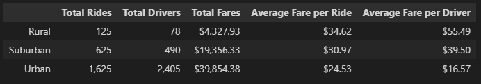

# PyBer_Analysis

## Overview

- The purpose of this analysis is to complete the following tasks:

    - Create a summary DataFrame of the PyBer ride-sharing data by city type.

    - Using Pandas and Matplotlib, create a multiple-line graph that shows the total weekly fares for each city type.

    - A written report that summarizes how the data differs by city type and how those differences can be used by decision-makers at PyBer.

## Results

### Pyber Summary

- The summary above is indicative of a few key factors:
    - Urban areas have the largest pool of drivers, and bring in the largest portion of the Total Fares column.
    - Despite this fact, on average urban drivers see the smallest return in average fare per ride, and average fare per driver.
    - Rural cities see the highest return for drivers in average fare per ride, and average fare per driver.
    - However, this dataset does not divulge the average length of trip per region type.
        - (Rural trips could possibly be further apart, thus accounting for the inflated average fare per ride, and average fare per driver)

- This graph is representitive of the following:
    - There is a larger use of PyBer ridesharing in urban cities than the other two types.
    - There are more drivers in urban cities than rural cities.
    - The majority of PyBer's revenue occurs in urban cities.
    - On the other hand, drivers in rural areas tend to have fares that are better for the drivers when compared to urban and suburban areas.
    

## Summary

- My recommendations for Pyber would be:

    - Improve incentives for urban and suburban drivers to maintain a steady growth of those two driver pools

    - Improve hiring campaigns and advertising awarness of Pyber's servives in rural areas to increase growth in a region that sees high return for average fare per ride and driver.

    - Begin tracking average length of trip either in time or distance.

        - This will help the company better understand a potential causal effect of average fare per ride in rural areas, as well as what areas may need additional drivers to meet high demand and long trip times.

        - A lack of avalibility of drivers due to this downtime could result in a loss of potential profit.

